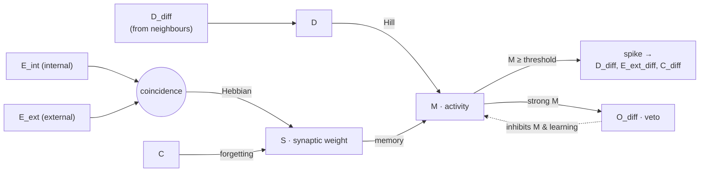

<div align="center">

# 🧫 BioKan

**KAN-inspired unsupervised learning in a bacterial consortium.**

[Kolmogorov–Arnold Networks (KANs)](https://arxiv.org/abs/2404.19756) replace a
neural network's fixed neurons with *learnable functions on its edges*. **BioKan
asks whether that idea can be embodied in living matter: can a consortium of
engineered bacteria, with no central controller, learn to compute?**

Here every cell is a small gene-regulatory circuit. Cells talk to one another only
through **diffusing signalling molecules** (a quorum-sensing-like channel), and each
cell carries an internal *synaptic weight* that is adjusted **locally and without a
supervisor**, by a molecular Hebbian coincidence rule — the biological counterpart of
a learnable edge. The scientific question is whether such purely local plasticity,
distributed over a spatial community, is enough for the colony to **self-organize into
a working computation**.

This repository demonstrates it *in silico*: a stochastic
([Catalyst](https://docs.sciml.ai/Catalyst/stable/) / Gillespie) simulation of the
consortium is trained, by teacher forcing, to perform **associative (Pavlovian)
conditioning** and to realise the full family of **two-input Boolean logic gates**.

📄 **[Read the internship report (PDF)](report/rapport_DEUMIER_Constantin.pdf)**

</div>

---

## The idea

Every cell is a tiny recurrent unit. It integrates the input it receives from its
neighbours, keeps a persistent synaptic weight `S`, and fires (spikes) when its
activity `M` crosses a threshold — broadcasting signals back into the medium. The
synaptic weight is updated by a **Hebbian coincidence rule**, so a population of
identical cells wired into a topology can be trained, by teacher forcing, to
compute a target function.



## `src/` — the core

The engine is a small, self-contained library. `BioKan.jl` is the entry point and
re-exports the public API.

| Module | Responsibility | Key exports |
| --- | --- | --- |
| `Bacterias.jl` | The single cell: gene-regulatory `ReactionSystem`, plus a `Bacterium` wrapper that steps it with SSA or ODE. | `create_hebbian_non_spike_model`, `Bacterium`, `step_bacterium!`, `get_species` / `set_species!`, `notify_bacterium!`, `map_symbols_to_species` |
| `Network.jl` | The colony: a `BioNetwork` of cells placed in space, its edges, and role assignment (inputs / output / interneurons). | `BioNetwork`, `add_bacterium!`, `build_edges!`, `build_network_cube!`, `assign_conditioning_roles`, `plot_bionetwork_3d` |
| `Diffusion.jl` | Intercellular transport: physics-based coupling weights (Brownian hitting probability with a decay length) and per-step signal propagation, instantaneous or delayed. | `compute_static_coupling_physics`, `propagate_signals_instantaneous!`, `propagate_signals_delayed!` |
| `Hebbian.jl` | The task layer: training/test protocols, the logic-gate truth tables, and the loss functions. | `pattern_to_learn_xor`, `pattern_to_learn_conditioning`, `compute_loss_conditioning`, `LOGIC_GATES` |
| `BioKan.jl` | Module entry point that includes the above and re-exports everything. | — |

### Molecular species

Each cell tracks 15 species. The internal state:

| Species | Role |
| --- | --- |
| `D` | Received input (dendritic signal), driven by neighbours' `D_diff`. |
| `M` | Activity level — the variable whose threshold triggers a spike. |
| `S` | Synaptic weight / **memory** — updated by the Hebbian rule. |
| `E_int`, `E_ext` | Internal (post) and external (pre) eligibility signals; their **coincidence** drives learning of `S`. |
| `C` | Forgetting signal — degrades `S` in the absence of input. |
| `O` | Output / **veto** — a strongly active cell emits `O`, which inhibits activity and learning. |
| `I`, `T` | Inhibition and an internal delay buffer (`T → E_int`). |
| `mRNA_M`, `mRNA_S` | Transcripts of the activity and memory proteins. |

The secreted, diffusible forms `D_diff`, `E_ext_diff`, `C_diff`, `O_diff` are the
signals actually transported between cells by `Diffusion.jl`.

## `experiments/` — the report experiments

Each script is standalone: it builds the network, runs the training/test protocol,
prints a score, and saves diagnostic plots under `outputs/`.

| Script | What it does |
| --- | --- |
| `conditioning.jl` | CS+/CS- associative (Pavlovian) conditioning on a 27-cell cube. |
| `logic_gates.jl` | Learns a 2-input logic gate on an 8-cell Y topology. |
| `logic_gates_pacemaker.jl` | Same task, with the reference input driven as a pacemaker. |
| `logic_gates_6bacteria.jl` | Simplified 6-cell variant (no interneurons). |

The logic-gate scripts take the target gate as their first argument — any key of
`BioKan.LOGIC_GATES` (`:XOR`, `:AND`, `:OR`, `:NAND`, …):

```bash
julia --project=. experiments/logic_gates.jl XOR
julia --project=. --threads=auto experiments/conditioning.jl
```

## Using it as a library

```julia
include("src/BioKan.jl")
using .BioKan
using Catalyst

circuit, defaults = create_hebbian_non_spike_model(:node)
params = Dict(parameters(circuit) .=> defaults)
u0     = map_symbols_to_species(circuit, Dict(:D => 0.0, :M => 0.0, :S => 0.0))

b = Bacterium(1, [0.0, 0.0], circuit, params, u0; mode=:ssa)
set_species!(b, :S, 50.0)
step_bacterium!(b, 1.0)
@show get_species(b, :M)
```

## Tests

```bash
julia --project=. -e 'using Pkg; Pkg.test()'
```

## Install

Requires **Julia ≥ 1.10**.

```bash
julia --project=. -e 'using Pkg; Pkg.instantiate()'
```

Main dependencies: `Catalyst`, `JumpProcesses`, `OrdinaryDiffEq`,
`ModelingToolkit`, `Plots`.
